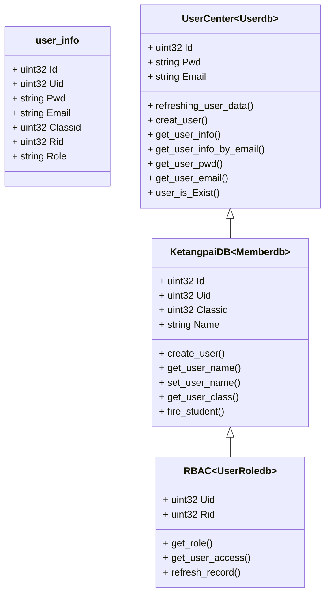
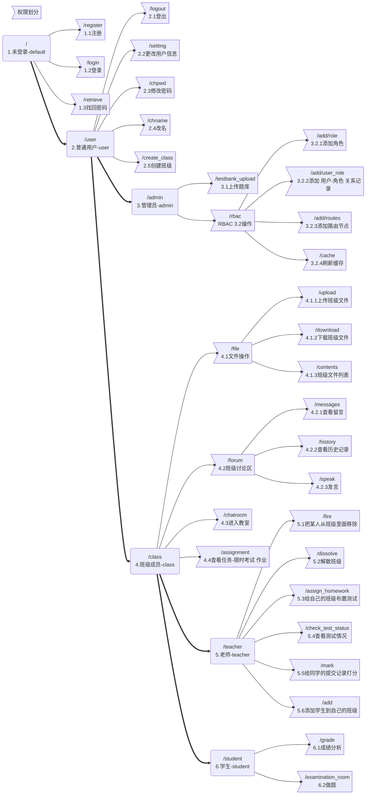

# ？

> 其中邮件以及mq相关设置因为涉及鄙人个人信息所以上传的版本不可用，
>
> 虽然用到了grpc但为了写代码方便用协程来代替机群，耦合度较低可以直接将server.go的协程服务拆成单独的程序，记得要讲global.go和funcs.go复制一份。(除了logs部分…)
>
> 

目录：

> 如果没有把服务单独拆出来：
>
> - exercise
> - files
> - logs
>     - info
>     - error
> - submit
> - test

## 功能

> 账号注册登录注销？
>
> 创建课堂,布置作业
>
> 上传-下载课件资料
>
> 发布话题-话题讨论
>
> 上课签到
>
> 课中提问(学生or老师)和回答（抢答or抽答）
>
> 成绩管理

特殊说明

> 参数有可选必选之分，但由于历史原因，有的时候必选参数不给也能得到结果，只是结果不尽人意，所以该类型参数可以认为‘建议必选’

## 用到的第三方库

```http
github.com/gin-gonic/gin
github.com/gomodule/redigo/redis
github.com/streadway/amqp
gorm.io/gorm
```

## 用户数据组成




## 类型说明

```go
package Exercise
const (
	DefaultTyp = iota
	Unlimited 	//不限时
	LimitedDate			//有日期限制
	TimeLimit			//没有日期限制
	TypNum
)

//科目
const (
	DefaultDiscipline =iota
	Mathematics
	English
	Physics
	CLang
	Python
	Java
	Sports
	DisciplineNum
)


package TestBank
//科目
const (
	DefaultDiscipline =iota
	Mathematics
	English
	Physics
	CLang
	Python
	Java
	Sports
	DisciplineNum
)

//题目类型
const (
	DefaultTyp=iota
	Subjective//主观题
	Objective //客观题-判断题、选择题等
	TypNum
)

package UserCenter
//用户类型
const (
	DefaultType = iota
	Teacher
	Student
	Administrator
	TypeNum
)
```


## 路由结构

```go
server.GET("/register", Handlers.Register(s.User,s.Email))
server.POST("/login", Middlewares.CheakUserInfo(s.User),Handlers.Login(s.JWT))
server.POST("/retrieve",Handlers.Retrieve(s.User,s.Email))//找回密码

user:=server.Group("/user",Middlewares.CheakJWT(s.JWT,s.User,s.KetangpaiDB,s.RBAC))//已登录
{
    user.POST("/logout", Handlers.Logout(s.JWT))//注销
    user.GET("/setting", Handlers.Setting())  //获取信息
    user.GET("/chpwd", Handlers.Chpwd(s.User,s.Email)) //修改密码 password - websocket
    user.POST("/chname",Handlers.Chname(s.KetangpaiDB))//改名
    user.POST("/create_class", Handlers.Create_class(s.KetangpaiDB,s.RBAC)) //创建班级

    admin:=user.Group("/admin",Middlewares.CheakRole(s.RBAC,"/admin"))//管理员？
    {
        admin.POST("/testbank_upload",Handlers.Testbank_upload(s.TestBank))//上传

        rbac:=admin.Group("/rbac")
        {
            rbac.POST("/add/role",Handlers.Add_role(s.RBAC))//添加角色
            rbac.POST("/add/user_role",Handlers.Add_user_role(s.RBAC))//添加 用户-角色
            rbac.POST("/add/routes",Handlers.Add_routes(s.RBAC))//添加 路由
            rbac.POST("/cache",Handlers.Cache(s.RBAC))//刷新缓存
        }
    }

    classmember:=user.Group("/class", Middlewares.CheakRole(s.RBAC,"/class"))//班级成员
    {
        file:=classmember.Group("/file")//班级文件操作
        {
            file.POST("upload", Handlers.File_upload(s.NetworkDisk))    //上传文件
            file.GET("download", Handlers.File_download(s.NetworkDisk)) //下载文件
            file.GET("contents", Handlers.File_contents(s.NetworkDisk)) //查看目录
        }

        forum:=classmember.Group("/forum")//讨论区操作
        {
            forum.GET("/history", Handlers.History(s.Forum))                     //查看记录
            forum.POST("/speak",Handlers.Speak(s.Forum,s.Filter))              //发言
            forum.GET("/messages",Handlers.Messages(s.Forum))            //查看留言
        }

        classmember.GET("/chatroom",Handlers.ChatRoom(s.Filter,rooms,s.RankingList))//进入教室
        classmember.GET("/assignment", Handlers.Assignment(s.Exercise)) //查看任务-限时考试、作业

        teacher:=classmember.Group("/teacher", Middlewares.CheakRole(s.RBAC,"/teacher"))//班级负责人
        {
            teacher.POST("/fire", Handlers.Fire(s.KetangpaiDB))                 			//开除某人
            teacher.POST("/dissolve", Handlers.Dissolve(s.KetangpaiDB,s.Exercise))         //解散班级
            teacher.POST("/assign_homework", Handlers.Assign_homework(s.Exercise,s.TestBank))//布置作业
            teacher.GET("/check_test_status", Handlers.Check_test_status(s.Exercise))//查看考试情况
            teacher.POST("/mark",Handlers.Mark(s.Exercise))//打分
            teacher.POST("/add",Handlers.Add(s.KetangpaiDB))//把某些人添加进班级
        }

        student := classmember.Group("/student", Middlewares.CheakRole(s.RBAC,"/student")) //同学
        {
            student.GET("/grade", Handlers.Grade(s.Exercise))                       //成绩分析
            student.GET("/examination_room",Handlers.Examination_room(s.Exercise,s.TestBank))//开始做题
        }
    }
}
```


## 操作说明

### 1.注册

> 拥有一个账号是一切的开始
>
> 如果成功将会返回UID等重要信息

```http
GET ws://host/register
```

> 建立websocket连接后用户需要以JSON格式传回以下数据

| KEY   | 类型        | 描述         |
| ----- | ----------- | ------------ |
| email | string 必选 | 电子邮件地址 |
| pwd   | string 必选 | 密码         |

```json
{
    "email":"",
    "pwd":""
}
```


> 如果一切顺利的话会收到含有验证码的邮件，将验证码以纯文本的形式传回即可，最后在返回相关信息后服务器会主动断开连接

### 2.登录

> 拿到上一步的UID和颅内密码后就可以进行下一步登陆了
>
> 如果成功将会返回JWT

```http
POST host/login
```

fohrm-data

| KEY   | 类型        | 描述         |
| ----- | ----------- | ------------ |
| uid   | uint32 可选 | UID          |
| pwd   | string 必选 | 密码         |
| email | string 必选 | 电子邮件地址 |

> **到这里就可以使用了，后续操作都需要登陆后的JWT**
>
> 将JWT放在header里面，key为token

### 3.密码找回

```http
POST host/retrieve?email
```

> 根据email确定用户并把信息发送到email

### 4.注销

> 指退出登录
>
> 自动退出

```http
POST host/user/logout
```

### 5.查看信息

> 查看/调整
>

```http
GET host/user/setting
```

### 6.修改密码

```http
GET ws://host/user/chpwd?pwd
```

> pwd指定新密码，长度不小于6位

### 7.创建班级

```http
POST host/user/create_class
```

form-data

| KEY      | 类型          | 描述     |
| -------- | ------------- | -------- |
| name     | string 必选   | 班级名   |
| students | []uint32 必选 | 班级成员 |

### 8.题库操作

> 只对管理员开放，不提供注册管理员的方法

```http
POST host:/user/admin/testbank_upload
```

form-data

| KEY        | 类型        | 描述                     |
| ---------- | ----------- | ------------------------ |
| typ        | uint32 必选 | 题目类型                 |
| content    | string 必选 | 题目主体                 |
| ans        | string 可选 | 答案                     |
| name       | string 必选 | 可以是方便记忆的任何内容 |
| discipline | uint32 必选 | 科目                     |
| withans    | bool必选    | 自带答案？               |


### 9.添加角色

```http
POST /user/admin/rbac/add/role
```

bady

```json
{
    []
}
```

> 角色列表-string类型

### 10.添加 用户-角色 关系记录

```http
POST /user/admin/rbac/add/user_role
```

form-data

| KEY  | 类型        | 描述   |
| ---- | ----------- | ------ |
| uid  | uint32 必选 | UID    |
| role | string 必选 | 角色名 |

### 11.添加路由结构

```http
POST /user/admin/rbac/add/routes
```

body

```json
[]
```

> 路由列表-string:第一个认为是后面所有路由的直接前驱，如果没有前驱用“”\(空字符串\)代替


### 12.上传班级文件

```http
POST /user/class/file/upload
```

form-data

| KEY  | 类型 | 描述       |
| ---- | ---- | ---------- |
| file | 必选 | 上传的文件 |

### 13.下载文件

```http
GET /user/class/file/download?fileid
```

> fileid: 文件ID

### 14.查看文件列表

```http
GET user/class/file/contents
```

> 不需要特殊参数

### 15.查看讨论区

```http
GET user/class/forum/history
```

> 获取记录

### 16.讨论区发言

```http
POST user/class/forum/speak
```

> 发言

form-data

| KEY     | 类型 | 描述         |
| ------- | ---- | ------------ |
| content | 必选 | 内容         |
| tosb    | 可选 | 指定发给某人 |

> Tosb是to somebody的简写，即使明确该字段所有人也能看见，只是somebody可以通过下面的方式快速查看

### 17.查看留言

```http
GET /user/class/forum/messages
```

> 不需要参数

### 18.实时交流

```http
GET ws://user/class/chatroom
```

> websocket直接接入

```json
{
    "content":"",
    "to":[]
}
```


### 19.查看班级任务

```http
GET /user/class/assignment
```

> 列出班级任务列表

### 20.从自己的班级里面除名某些人

```http
POST /user/class/teacher/fire
```

body

```json
[]
```

> 直接传一个数组，里面放UID

### 21.解散班级

```http
POST /user/class/teacher/dissolve
```

> 不需要别的参数，自动解散

### 22.是时候给同学们布置任务了

```http
POST user/class/teacher/assign_homework?auto&subjective&objective
```

> 有两种模式，以auto的值做区分

> 如果auto为1则内容自动生成，此时subjective、objective的取值代表主观题与客观题的数量。

>  其他取值认为用户自己上传内容

> **上面两种只区分内容，其他信息由form决定**

| KEY        | 类型 | 描述                   |
| ---------- | ---- | ---------------------- |
| typ        | 必选 | 类型(限时/限日期/不限) |
| begin      | 可选 | 开始日期               |
| end        | 可选 | 结束日期               |
| duration   | 可选 | 持续时间               |
| name       | 必选 | 任务名                 |
| content    | 可选 | 内容                   |
| discipline | 必选 | 科目                   |

> 和时间有关的统一使用Unix时间戳

content: (JSON文本,由前端解决。)

```json
[
    {"content":""}
]
```


### 23.让我看看他们做得怎么样了

```http
GET /user/class/teacher/check_test_status?id
```

> (id指任务id)如果id已指定就会返回对应任务的提交情况，否则列出所有历史任务

### 24.打分时间

```http
POST user/class/teacher/mark?id&v
```

> id:提交记录的ID	v:分值

> 来看看学生这边

### 25.把某些人添加进班级

```http
POST user/class/teacher/add
```

body

```json
[]
```

> UID-uint32 列表

### 26.查看分值

```http
GET user/class/student/grade?id
```

> id:提交记录ID 如果不指定的话返回所有提交记录

### 27.请诚信考试…

```http
GET ws://user/class/student/examination_room?eid
```

> eid:任务ID 进行指定的任务，由于后台阻塞接收，所以要等到前边提交后才能判断时间

body

```json
[
    {
        "testid":,
        "content":""
    }
]
```


## services

> 服务与服务之间不能直接访问

### Email

> 邮件服务

```protobuf
syntax="proto3";
option go_package="./Email";
package Email;

service Email{
  rpc send(mail)returns(empty){};//发邮件
}

message mail{
  string subject=1;//主题
  string content=2;//内容
  string to=3;//收件人
}

message empty{}
```


### Exercise

> 处理布置的任务

```protobuf
syntax="proto3";
option go_package="./exercise";
package exercise;

service exercise{
  rpc get_exercise(i)returns(exerciseData){};//根据考试号获取考试详情-不含题目内容
  rpc get_exercisec(i)returns(exerciseData){};//根据考试号获取考试详情-含题目内容
  rpc get_exercises(i)returns(stream exerciseData){};//根据班级号获取考试列表
  rpc add_exercise(exerciseData)returns(exerciseData){};//添加一次考试
  rpc submit_ans(submit)returns(i){};//提交一次考试记录-这里不做时间检测
  rpc get_key(i)returns(submit){};//根据考试ID获取答案
  rpc set_score(score)returns(empty1){};//给学生打分
  rpc get_score(i)returns(score){};//学生根据提交记录获取本次得分
  rpc get_scores(i)returns(stream submit){};//学生根据自己的ID获取所有提交记录
  rpc get_class_scores(i)returns(stream score){};//老师根据考试ID获取本次班级得分情况
  rpc get_class_submit(i)returns(stream submit){};//老师根据考试ID获取本次提交情况
  rpc del_exercise(i)returns(empty1){};//根据考试ID删除考试记录-试题，提交记录等
  rpc del_exercises(i)returns(empty1){};//根据班级ID删除该班级所有记录
}

message empty1{}

message i{
  uint32 i=1;
}

message exerciseData{
  uint32 id=1;//数据自身ID
  uint32 classid=2;//所属班级
  uint32 ownerid=3;//发布人
  repeated string content=4;//内容-testdbJSON文件
  uint32 typ=5;//类型起始日期与截止日期、无时间限制、单次限时
  int64 begin=6;//起始日期
  int64 end=7;//截止日期
  uint64 duration=8;//持续时长
  string name=9;//考试名
  uint32 Discipline=10;//科目
  bytes ans=11;//JSON文本 map[testid]ans-map[uint32]string
}

message submit{//只记录最近的一次-在时限内可以多次提交
  uint32 id=1;//数据本身的ID-固定！！！
  uint32 uploaderid=2;//上传者ID
  uint32 exerciseid=3;//考试ID
  repeated string contents=4;//提交内容
  int32 value=5;//得分-负表示没给分
}

message score{
  uint32 submitid=1;//提交记录
  uint32 judge=2;//打分人
  int32 value=3;//分值
}
```

### Filter

> 敏感词句过滤

```protobuf
syntax="proto3";
option go_package="./Filter";
package Filter;

service Filter{
  rpc Process(FilterData)returns(FilterData){};
  rpc Add(FilterData)returns(FilterData){};

}

message right{
  bool right=1;
}

message FilterData{
  bytes data=1;
}
```

### Forum

> 留言等…

```protobuf
//留言什么的
syntax="proto3";
option go_package="./Forum";
package Forum;

service Forum{
  rpc speak(message)returns(message){};//发言
  rpc get_message(uid)returns(messages){};//查看别人给自己的留言
  rpc get_history(classid)returns(messages){};//查看班级历史
}

message classid{
  uint32 id=1;
}

message uid{
  uint32 id=1;
}

message message{
  uint32 id=1;//自身ID
  uint32 owner=2;//发起者
  uint32 tosb=3;//对某人说的
  string content=4;//说了啥？
  int64 time=5;//说的时间
  uint32 classid=6;//所属班级
}

message messages{//一段话
  repeated message m=1;
}
```

### JWT

> 生成和检测JWT

```protobuf
syntax="proto3";
option go_package="./JWT";
package JWT;

service JWT{
  rpc refresh_token(juser) returns(token){};//刷新token
  rpc check_token(token)returns(juser){};//检查token
  rpc del_jwt(juser)returns(token){};//删除token
}

message token{
  string content=1;
}

message juser{
  string email=1;
  uint32 id=2;
  string pwd=3;
}
```

> 主要任务是token操作，用Redis进行token的缓存

### KetangpaiDB

```protobuf
syntax="proto3";
option go_package="./KetangpaiDB";
package ketangpaiDB;

service ketangpaiDB{
  rpc create_user(user)returns(user){};//创建用户(用户中心已存在-适应用户中心的UID创建记录)
  rpc get_users(empty)returns(users){};//获取所有用户
  rpc get_user_info(user)returns(user){}//获取用户所有信息
  rpc get_user_name(uids)returns(names){};//获取名字
  rpc set_user_name(user)returns(name){};//修改用户名
  rpc get_user_class(uid)returns(classid){};//获取班级
  rpc create_class(class)returns(class){};//创建一个班级
  rpc get_class_info(classid)returns(class){};//获取班级所有信息
  rpc get_class_teacher(classid)returns(uid){};//获取班级负责人ID
  rpc get_class_name(classid)returns(classname){};//获取班级名字
  rpc dissolve_class(classid)returns(empty){};//解散班级
  rpc refreshing_class_data(class)returns(class){};//更新班级数据-名字、老师
  rpc fire_student(uid)returns(class){};//将某学生从班级里面删除
  rpc add_student(member)returns(class){};//添加某个学生到班级
}

message empty{
}

message name{
  string name=1;
}

message names{
  repeated string names=1;
}

message uid{
  uint32 uid=1;
}

message uids{
  repeated uint32 uids=1;
}

message user{
  uint32 uid=1;//本产品的ID
  string name=2;
  uint32 id=3;//用户中心的ID
  uint32 classid=4;//所属班级
}

message users{
  repeated user users=1;
}

message classid{
  uint32 classid=1;
}

message classname{
  string name=1;
}

message member{
  uint32 uid=1;
  uint32 classid=2;
}

message class{
  uint32 classid=1;
  uint32 teacher=2;
  string name=3;
  repeated uint32 students=4;
}
```

> ketangpai数据

### NetworkDisk

> 班级文件管理

```protobuf
syntax="proto3";
option go_package="./NetworkDisk";
package NetworkDisk;

service NetworkDisk{
  rpc download(fileid)returns(stream filestream);//下载文件
  rpc upload(stream filestream)returns(fileinfo);//上传文件
  rpc get_contents(classid)returns(contents);//获取文件目录
}

message fileid{
  uint32 id=1;
}

message classid{
  uint32 id=1;
}

message contents{
  repeated string name=1;
  repeated uint32 id=2;
}

message filestream{
  bytes content=1;
}

message fileinfo{
  uint32 id=1;
  uint32 uploader=2;
  uint32 classid=3;
  string name=4;
  uint64 size=5;
  int64 time=6;//Unix时间戳居然不是无符号整形
  uint64 unit=7;
}
```

### RankingList

> 排行榜

```protobuf
syntax="proto3";
option go_package="./RankingList";
package RankingList;

//成员与排名：一对一
//排名与成员：多对多

service RankingList{
  rpc flushlist(flushin)returns(flushout){};//刷新榜单-用传入的数据刷新 榜单、成员名、刷新量
  rpc getlistinfo(listname)returns(listinfo){};//获取排行榜完整信息
  rpc dellist(listname)returns(empty){};//删除榜单
  rpc getranking(members)returns(rankings){};//获取排名
}

message empty{}

message listname{
  string name=1;
}

message members{
  string name=1;//榜单名
  repeated string members=2;
}

message rankings{
  repeated int64 rank=1;
}

message flushin{
  string key=1;//刷新的表
  int32 increment=2;//刷新量
  string member=3;//刷新对象

}

message flushout{
  string member=1;//刷新对象
  int64 ranking=2;//刷新后排名-不是uint64类型(受Redis框架返回值影响)
}

message listinfo{
  string name=1;//榜名
  repeated string list=2;//榜单-仅对象/对象+分值、、、
}

```


### RBAC

> 权限管理

```protobuf
syntax="proto3";
option go_package="./RBAC";
package RBAC;

service RBAC{
  rpc get_role(uids)returns(roles){};//获取用户的角色
  rpc get_paths(path)returns(paths){};//获取所有的 路由子节点
  rpc add_role(roles)returns(empty){};//添加角色
  rpc refresh_paths(paths)returns(empty){};//添加路由分支 - 第一个元素为父节点
  rpc refresh_user_role(users_roles)returns(empty){};//添加 用户-角色 关系
  rpc cheak_role_path(roles_paths)returns(Bools){};//验证角色与路由的关系
  rpc Cache(empty)returns(empty){};//刷新缓存
}

message Bool{
  bool bool=1;
}

message Bools{
  repeated bool Bools=1;
}

message uid{
  uint32 uid=1;
}

message uids{
  repeated uint32 uids=1;
}

message role{
  string role=1;
}

message roles{
  repeated string roles=1;
}

message empty{}

message path{
  string path=1;//路径名
}

message paths{
  repeated string paths=1;
}

message role_path{
  string role=1;
  string path=2;
}

message roles_paths{
  repeated string roles=1;
  repeated string paths=2;
}

message user_role{
  uint32 uid=1;
  string role=2;
}

message users_roles{
  repeated uint32 uids=1;
  repeated string roles=2;
}
```

### TestBank

> 试题库

```protobuf
syntax="proto3";
option go_package="./TestBank";
package TestBank;

service TestBank{
  rpc upload(test)returns(test){};//上传一道题
  rpc download(stream testid)returns(stream test){};//下载题目
  rpc generate_test(testconf)returns(tests){};//自动生成一套试卷
  rpc get_ans(testids)returns(anss){};//获取答案
}

message ans{//答案
  string ans=1;
}

message anss{
  repeated string anss=1;
}

message testid{//试题ID
  uint32 id=1;
}

message testids{
  repeated uint32 testids=1;
}

message testconf{
  uint32 subjective_item=1;//主观题的数量
  uint32 objective_item=2;//客观题的数量
  uint32 discipline=3;//学科
}

message test{
  uint32 id=1;//自身ID
  uint32 typ=2;//类型-主观题/客观题
  string content=3;//内容
  string ans=4;//答案(如果有)
  string name=5;//名字-题目描述
  uint32 uploader=6;//上传者
  uint32 discipline=7;//学科
  bool  withans=8;//附带答案？
}

message tests{
  repeated string tests=1;//JSON文本
  bytes ans=2;//答案 JSON-byte
}
```

### UserCenter

> 储存用户通用信息

```protobuf
syntax="proto3";
option go_package="./UserCenter";
package UserCenter;

service UserCenter{
  rpc refreshing_user_data(uuser)returns(uuser){};//刷新用户数据
  rpc creat_user(uuser) returns(uuser){};//创建用户
  rpc get_user_info(id) returns(uuser){};//获取用户所有信息
  rpc get_user_info_by_email(s)returns(uuser){};//参照邮箱返回用户信息
  rpc get_user_pwd(id)returns(s){};//获取密码
  rpc get_user_email(id)returns(s){};//获取联系方式
  rpc user_is_Exist(s)returns(right){};//判断用户是否存在:以邮箱为标准
}

message id{
  uint32 i=1;
}

message s{
  string s=1;
}

message right{
  bool right=1;
}

message uuser{
  uint32 id=1;
  string pwd=2;
  string email=3;
}
```

> 使用MySQL储存，用uusers和class两张表

### Log

> 收集日志，使用rabbitmq

> 关于该服务：这部分写得并不好，因为error等级没有明确的划分，不管是因为用户的数据有问题还是程序执行过程中自己产生的问题都一视同仁，这样并不利于后面的维护以及及时报警(打算用邮件通知)。

## RBAC





# ？

> 稀奇古怪的坑：
>
> 如果用JSON传bool，千万不要设置为binding:”required”	当值为false时为0值，反序列化时会忽略0值导致报错，整数为0也会有相同的情况

> 下一步
>
> 将Email部分由rpc改为mq